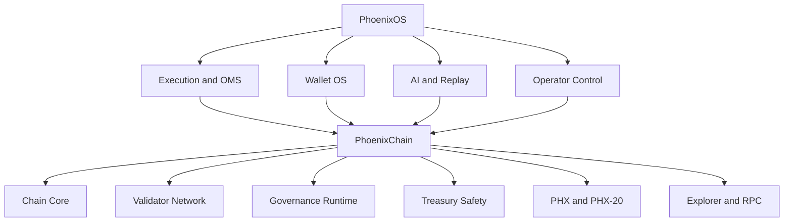

# PhoenixOSChain

[](docs/WHY_PHOENIXCHAIN.md)
[](docs/VALIDATOR_NETWORK.md)
[](docs/GOVERNANCE_AND_TREASURY.md)
[](LICENSE)

PhoenixOSChain is the public repository for **PhoenixChain**: a financial-infrastructure-first Layer 1 designed to sit beside PhoenixOS as its sovereign settlement, governance, validator, treasury, and asset runtime.

This repository is built to create a very specific reaction:

- strong enough that serious builders, operators, and investors immediately understand the ambition
- disciplined enough that the codebase does not give away the commercial right to clone the product

## The Pitch

PhoenixChain is not trying to be one more token shell.

It is being built as a chain for:

- validator-secured financial infrastructure
- governance-aware treasury coordination
- PHX-native monetary policy
- PHX-20 asset issuance and lifecycle support
- wallet, explorer, validator, and execution interoperability with PhoenixOS

It is **not** positioned as:

- a meme chain
- a dashboard skin over somebody else's network
- fake decentralization theater
- a token page pretending to be infrastructure

## Why This Exists

PhoenixOS outgrew the boundaries of a single trading interface.

Once execution, OMS, wallet, governance, AI, replay, collaboration, and treasury coordination became part of the same operating system, the platform needed a sovereign trust layer that could eventually carry:

- protocol identity
- validator identity
- treasury legitimacy
- chain-native governance
- public financial infrastructure credibility

PhoenixChain is that layer.

## Architecture At A Glance



## Strategic Pillars

### 1. Validator-Centered Security

PhoenixChain is intentionally designed to feel like a chain with operators, health, lifecycle, and accountability. Validator surfaces are not decorative explorer cards.

### 2. Governance as Runtime

Proposal lifecycle, voting posture, treasury safety, audit trail, execution delay, and governance impact receipts are treated as chain-level responsibilities, not DAO cosmetics.

### 3. Monetary Clarity

The project prefers explicit monetary architecture over vague token marketing. PHX is positioned as protocol infrastructure, not a narrative prop.

### 4. Institutional Language

This repository tries to sound like infrastructure:

- what exists
- what is partial
- what is blocked
- what still needs audit, rehearsal, and launch discipline

## Current State

PhoenixChain is **advanced devnet / governance-runtime prototype software**.

It already contains real code for:

- chain state and block flow
- validator-facing devnet operations
- governance runtime foundations
- PHX-20 runtime surfaces
- RPC and explorer-style routes
- wallet/account primitives
- operational and security documentation

It is **not yet a production mainnet**.

## Repository Layout

- `cmd/phoenixd`
  node binary and CLI entrypoint
- `internal/chain`
  block, genesis, validation, and chain state flow
- `internal/consensus`
  consensus foundations
- `internal/governance`
  proposal, audit, queue, and governance impact runtime foundations
- `internal/phx20`
  PHX-20 asset runtime
- `internal/rpc`
  RPC, explorer, governance, validator, and wallet-facing HTTP surfaces
- `internal/wallet`
  wallet and keystore primitives
- `internal/economics`
  monetary and tokenomics primitives
- `configs`
  devnet and chain configuration
- `docs`
  architecture, operations, security, validator, governance, and launch material
- `deploy`
  deploy scaffolding

## Start Here

If this is your first time seeing the project, read in this order:

1. [Why PhoenixChain Exists](docs/WHY_PHOENIXCHAIN.md)
2. [Architecture Overview](docs/ARCHITECTURE_OVERVIEW.md)
3. [Validator Network](docs/VALIDATOR_NETWORK.md)
4. [Governance and Treasury](docs/GOVERNANCE_AND_TREASURY.md)
5. [Governance Impact Receipts](docs/GOVERNANCE_IMPACT_RECEIPTS.md)
6. [Security Posture](docs/SECURITY_POSTURE.md)
7. [Mainnet Discipline](docs/MAINNET_DISCIPLINE.md)
8. [First Public Release Notes](docs/FIRST_PUBLIC_RELEASE.md)

## Deep Reading

- [Protocol](docs/protocol.md)
- [PHX Monetary Architecture](docs/PHX_MONETARY_ARCHITECTURE.md)
- [Canonical Asset and Contract Strategy](docs/CANONICAL_ASSET_AND_CONTRACT_STRATEGY.md)
- [PHX Contract Launch Checklist](docs/PHX_CONTRACT_LAUNCH_CHECKLIST.md)
- [PHX-20 Standard](docs/PHX20_STANDARD.md)
- [Threat Model](docs/threat-model.md)
- [Validator Operations](docs/validator-operations.md)
- [Mainnet Readiness](docs/mainnet-readiness.md)
- [Publish Checklist](docs/PUBLISH_CHECKLIST.md)

## Build

```powershell
go test ./...
go run ./cmd/phoenixd wallet new
go run ./cmd/phoenixd init --config configs/devnet-node-1.yaml
go run ./cmd/phoenixd start --config configs/devnet-node-1.yaml
```

## Devnet Bootstrap

```powershell
go run ./cmd/phoenixd devnet bootstrap --genesis configs/devnet.genesis.json --env .env.devnet --wallet-dir .phoenixchain/wallets
```

## Why This Repo Should Matter

PhoenixChain is not only a chain repository.
It is the chain half of a larger operating civilization:

- PhoenixOS handles execution, AI, replay, wallet, OMS, and operator tooling
- PhoenixChain carries network trust, validator identity, governance legitimacy, treasury discipline, and asset runtime

That pairing is the difference.

## Why This Is Different

Most projects choose one lane:

- chain
- wallet
- trading terminal
- governance portal
- AI assistant

PhoenixOS + PhoenixChain is aiming at a harder category:

**a financial operating system with its own sovereign infrastructure layer**

That means the chain is not marketing collateral for the app, and the app is not a thin frontend for the chain.
They are designed to reinforce each other.

## Who Should Care

- **validators** looking for an infrastructure-first network direction
- **builders** studying how governance, treasury, wallet, and execution can converge
- **researchers** exploring what comes after isolated crypto products
- **institutions** that care more about operational legitimacy than token spectacle
- **serious operators** who want to see whether a chain can be built as part of a larger financial machine

## Public Release Signal

This repository is public because the ambition should be visible.

The commercial rights are protected.
The operational secrets are not disclosed.
The architecture is clear enough to earn respect.

## License

This repository is **source-available, not open source**.

- Code is licensed under [PolyForm Strict 1.0.0](LICENSE).
- Commercial rights, redistribution rights, and derivative product rights are not granted here.
- Trademark, product identity, and branding rights are reserved.

If you want commercial, OEM, derivative, or redistribution rights, obtain a separate written license from the rights holder.

## Security Boundary

This public repository does **not** include production secrets, validator private keys, signer material, treasury credentials, internal infrastructure topology, recovery credentials, or other production-sensitive operational details.

Public code visibility does not imply operational disclosure.

Materials in this repository are intentionally curated to explain the architecture without exposing the security boundary.

## Final Note

PhoenixOSChain is published to make the direction obvious.

The goal is not to hide ambition.
The goal is to publish it clearly enough that serious people immediately understand the system, while keeping ownership and commercial control where it belongs.
