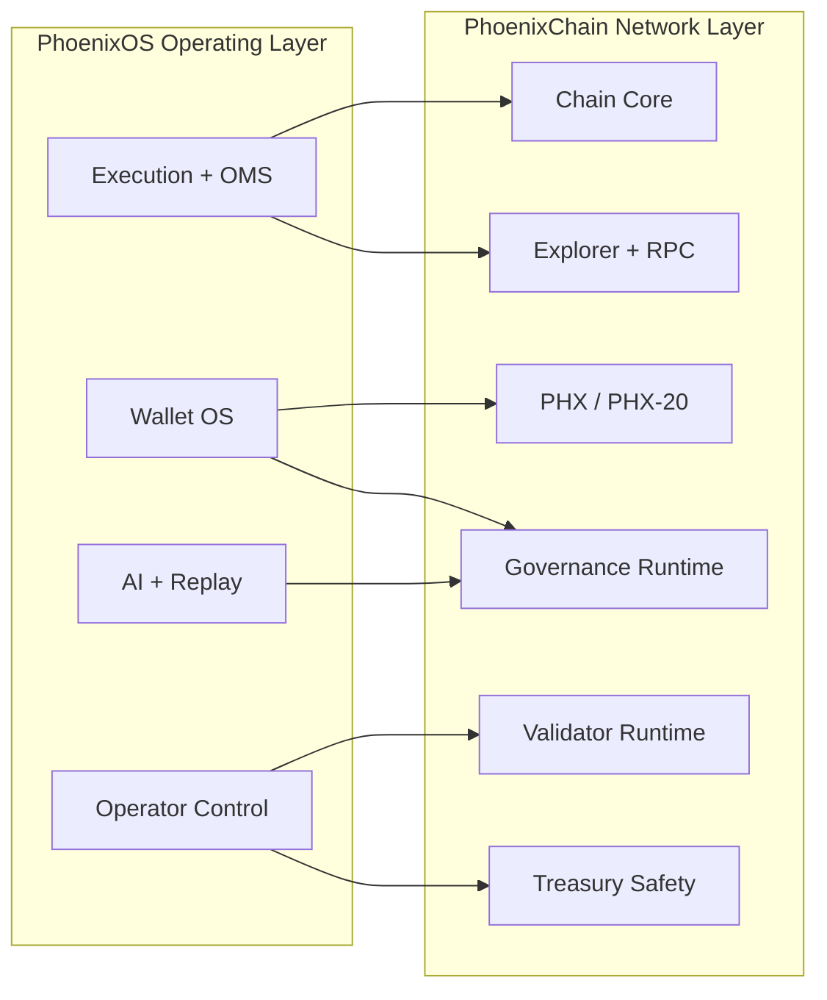

# Architecture Map

## Reading

The topology is straightforward:

- PhoenixOS is the operator environment
- PhoenixChain is the sovereign trust environment

PhoenixOS can coordinate.
PhoenixChain must eventually legitimize.
